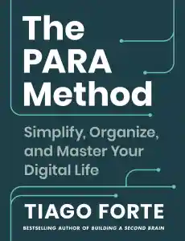

  
# Awesome PARA Method

Welcome to the Awesome PARA Method repository! 🚀 Here, we curate a collection of resources, tools, and links related to the PARA Method — a powerful organizational system developed by Tiago Forte.

The PARA Method is designed to help you effectively manage your digital and physical information, enabling a more productive and organized life.

 

### The PARA Method Blog Post and Book

Explore the official ["The PARA Method: The Simple System for Organizing Your Digital Life in Seconds"](https://fortelabs.com/blog/para/?utm_source=awesome-para-method) blog post and the official book ["The PARA Method,"](https://amzn.to/4axeUq5) to gain a deeper understanding of the methodology.

## Contents

- [Official Links](#official-links)
- [Blog Posts And Articles](#blog-posts-and-articles)
- [Videos](#videos)
- [Tools](#tools)

## Official Links

- [The PARA Method](https://fortelabs.com/blog/para/) - The blog post where you can start your journey.
- [The PARA Method Book](https://amzn.to/4axeUq5) - Tiago Forte's book on PARA Method.
- [Building a Second Brain Foundation](<https://www.buildingasecondbrain.com/foundation>) - Tiago Forte's course on Building a Second Brain, a technique that uses the PARA Method.

## Blog Posts and Articles

A lot of blog posts about PARA only rehashes what Tiago wrote. Below are our suggestions that really adds to the conversation.

- [Using PARA to Organize Your Notion Workspace](https://mariepoulin.com/blog/using-para-to-organize-your-notion-workspace/) - Marie Poulon gives some good examples on organizing PARA in Notion

## Videos

- Tiago Forte on how he uses PARA himself:
  - [PART 1: The PARA Method Explained](https://www.youtube.com/watch?v=T6Mfl1OywM8)
  - [PART 2: The 10-to-15 Rule (creating your projects)](https://www.youtube.com/watch?v=anexySaCsgU)
  - [PART 3: How I Use PARA Every Week](https://www.youtube.com/watch?v=MyWmGDnWhjE)
  - [PART 4: My Second Brain on Apple Notes](https://www.youtube.com/watch?v=fioLhb1U4J0)

## Tools

Discover tools and applications that can help you effectively implement the PARA Method.

- [**Logseq**](https://logseq.com) - Open-source knowledge management tool that combines the flexibility of a plain text editor with the power of backlinks and bi-directional linking, making it an excellent choice for implementing the PARA Method and building a connected knowledge base.
  - [Add PARA Properties](https://github.com/georgeguimaraes/logseq-plugin-add-PARA-properties) - Logseq plugin to manage your PARA Method workflow using slash commands and page properties.
  - [Quickly PARA Method](https://github.com/YU000jp/logseq-plugin-quickly-para-method) - Logseq plugin to organize pages using the PARA Method.
- [**Notion**](https://notion.so) - An all-in-one workspace that combines note-taking, task management, and collaboration features.
  - [PARA Method Template for Notion](https://thomasjfrank.com/templates/para-method-template-for-notion/) - Thomas Frank's template for implementing PARA in Notion. Free.
- [**Obsidian**](https://obsidian.md) - A powerful note-taking app with a focus on building a knowledge graph, suitable for organizing and linking resources in your PARA setup.

## Contributing

We welcome contributions! If you have discovered a new tool, written an article, or found a resource that aligns with the PARA Method, please follow our [contribution guidelines](CONTRIBUTING.md) to add it to the repository.

## License

This project is licensed under the [CC0 License](LICENSE.md). Feel free to use, share, and adapt the content.

---
Happy organizing with the PARA Method! 🚀
